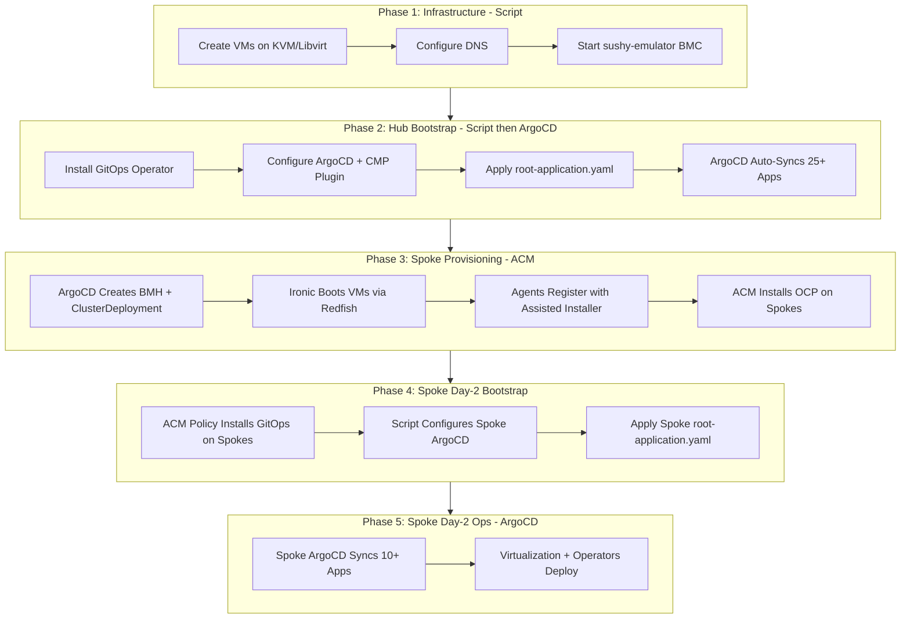
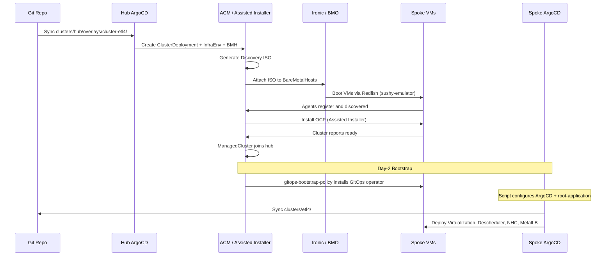

# End-to-End Architecture: GitOps-Driven OpenShift Hub + Spoke Deployment

## High-Level Overview

```
+-------------------------------------------------------------------------------------+
|                              Git Repository (Single Source of Truth)                 |
|                                                                                     |
|   clusters/hub/     clusters/etl4/     clusters/etl6/     groups/    components/    |
+--------+------------------+------------------+--------------------------------------+
         |                  |                  |
         v                  v                  v
+-----------------+  +--------------+  +--------------+
|   HUB CLUSTER   |  |  ETL4 SPOKE  |  |  ETL6 SPOKE  |
|   (OCP 4.20)    |  |  (OCP 4.20)  |  |  (OCP 4.20)  |
|                  |  |              |  |              |
|  +------------+  |  | +----------+ |  | +----------+ |
|  |  ArgoCD    |  |  | | ArgoCD   | |  | | ArgoCD   | |
|  |  (Hub)     |  |  | | (Spoke)  | |  | | (Spoke)  | |
|  +------------+  |  | +----------+ |  | +----------+ |
|  +------------+  |  |              |  |              |
|  |    ACM     |  |  |  Managed by  |  |  Managed by  |
|  | (Manager)  |<-+--+  Hub ACM     |  |  Hub ACM     |
|  +------------+  |  |              |  |              |
|  3 Masters       |  | 3 Masters    |  | 3 Masters    |
+-----------------+  +--------------+  +--------------+
```

## Deployment Flow (5 Phases)



## ArgoCD App-of-Apps Pattern

The hub and each spoke cluster use an **app-of-apps** pattern where a single
`root-applications` ArgoCD Application generates all child applications via a
Helm chart.

```
                         +-------------------------+
                         |    root-applications     |
                         |  (App-of-Apps Pattern)   |
                         |                          |
                         |  Source: clusters/<name>/ |
                         |  Plugin: CMP (envsub)    |
                         +------------+-------------+
                                      |
                    +-----------------+------------------+
                    |                 |                   |
                    v                 v                   v
           +---------------+ +---------------+  +---------------+
           |  groups/all   | |  groups/prod  |  | cluster-      |
           |  (shared)     | | (spokes only) |  | specific      |
           +-------+-------+ +-------+-------+  +-------+-------+
                   |                 |                   |
          Generates Apps    Generates Apps      Generates Apps
          via Helm chart    via Helm chart      via Helm chart
                   |                 |                   |
                   v                 v                   v
           +---------------+ +---------------+  +---------------+
           | ArgoCD Apps:  | | ArgoCD Apps:  |  | ArgoCD Apps:  |
           | cert-manager  | | ocp-virt      |  | metallb-cfg   |
           | metallb       | | descheduler   |  | nmstate-cfg   |
           | nmstate       | | NHC           |  | openshift-cfg |
           | kube-ops-view | | ...           |  | ...           |
           +-------+-------+ +-------+-------+  +-------+-------+
                   |                 |                   |
                   +--------+--------+-------------------+
                            |
                            v
                    +---------------+
                    | components/*  |
                    | (K8s manifests|
                    |  Subscriptions|
                    |  CRDs, CRs)  |
                    +---------------+
```

## Hub Cluster: ArgoCD Applications and Sync Waves

```
root-applications (Hub)
|
+-- Wave 5 -- Operators and Cluster Provisioning --------------------------
|   +-- acm-operator            --> ACM (Advanced Cluster Management)
|   +-- reflector-operator      --> Secret mirroring
|   +-- mtv-operator            --> Migration Toolkit for Virtualization
|
+-- Wave 15 -- Operator Instances ------------------------------------------
|   +-- acm-instance            --> MultiClusterHub CR
|   +-- mtv-configuration       --> ForkliftController CR
|
+-- Wave 20 -- Platform Operators, Policies, and Spoke Clusters -----------
|   +-- cert-manager-operator   --> TLS certificate management
|   +-- external-dns-operator   --> External DNS management
|   +-- metallb-operator        --> Load balancer for bare metal
|   +-- nmstate-operator        --> Node network configuration
|   +-- aap-operator            --> Ansible Automation Platform
|   +-- gitops-boostrap-policy  --> ACM policy: installs ArgoCD on spokes
|   +-- etl4                    --> Spoke BMH + ClusterDeployment + InfraEnv
|   +-- etl6                    --> Spoke BMH + ClusterDeployment + InfraEnv
|   +-- spoke1                  --> Spoke BMH + ClusterDeployment + InfraEnv
|
+-- Wave 25 -- Configurations ---------------------------------------------
|   +-- acm-configuration       --> AgentServiceConfig, Hive
|   +-- acm-observability       --> Observability (requires S3)
|   +-- cert-manager-config     --> ClusterIssuer, certificates
|   +-- external-dns-config     --> ExternalDNS CR
|   +-- metallb-configuration   --> IPAddressPool, L2Advertisement
|   +-- nmstate-configuration   --> NNCP, NAD
|   +-- nmstate-instance        --> NMState CR
|   +-- aap-configuration       --> AAP controller
|   +-- ova-server              --> MTV OVA provider
|
+-- Wave 30 -- Optional / Observability ------------------------------------
    +-- kube-ops-view           --> Cluster visualization dashboard
    +-- web-terminal-operator   --> Web terminal in console
```

## Spoke Clusters (etl4 / etl6): ArgoCD Applications and Sync Waves

```
root-applications (Spoke: etl4 or etl6)
|
|  -- From groups/prod (production workloads) ------------------------------
|
+-- Wave 5 -- Operators ----------------------------------------------------
|   +-- openshift-virtualization  --> OCP Virtualization operator
|   +-- descheduler-operator      --> Pod descheduler
|   +-- node-health-check-operator--> Node remediation
|
+-- Wave 15 -- Instances and Configs ----------------------------------------
|   +-- hyperconverged-instance   --> HyperConverged CR (enables CNV)
|   +-- descheduler-configuration --> KubeDescheduler CR
|   +-- node-health-check-config  --> NodeHealthCheck CR
|
|  -- From groups/all (shared across all clusters) -------------------------
|
+-- Wave 20 -- Shared Operators ---------------------------------------------
|   +-- cert-manager-operator     --> TLS certificates
|   +-- external-dns-operator     --> DNS management
|   +-- metallb-operator          --> Load balancer
|   +-- nmstate-operator          --> Network config
|
+-- Wave 25 -- Shared Configurations ----------------------------------------
|   +-- cert-manager-configuration
|   +-- external-dns-configuration
|   +-- nmstate-instance
|
|  -- From cluster-specific values ------------------------------------------
|
+-- Wave 6  -- metallb-configuration  --> Cluster-specific IPAddressPool
+-- Wave 15 -- nmstate-configuration  --> Cluster-specific NNCP
+-- Wave 16 -- openshift-config       --> ClusterVersion, OAuth
|
+-- Wave 30 -- Optional ------------------------------------------------------
    +-- kube-ops-view             --> Cluster visualization
    +-- web-terminal-operator     --> Web terminal
```

## Repository Structure

```
openshift-virtualization-gitops/
|
+-- .bootstrap/                         --- Day-0: Applied by script to seed ArgoCD
|   +-- subscription.yaml                   Install GitOps operator
|   +-- argocd.yaml                         Configure ArgoCD + CMP plugin
|   +-- root-application.yaml               App-of-apps entry point
|   +-- cluster-rolebinding.yaml            RBAC for ArgoCD
|
+-- .helm-charts/                       --- Reusable Helm charts
|   +-- argocd-app-of-app/                  Generates ArgoCD Application CRs
|   +-- bm-cluster-agent-install/           ACM / Assisted Installer resources
|   +-- cluster-registration/               ManagedCluster + KlusterletConfig
|
+-- clusters/                           --- What ArgoCD deploys WHERE
|   +-- hub/                                Hub ArgoCD reads this
|   |   +-- kustomization.yaml              Imports groups/all + hub values
|   |   +-- values.yaml                     25+ hub-specific apps
|   |   +-- overlays/
|   |       +-- cluster-etl4/               BMH + ACM resources for etl4
|   |       +-- cluster-etl6/               BMH + ACM resources for etl6
|   |       +-- metallb-configuration/      Hub MetalLB config
|   |       +-- nmstate-configuration/      Hub network config
|   |       +-- ova-server/                 MTV OVA provider
|   +-- etl4/                               ETL4 spoke ArgoCD reads this
|   |   +-- kustomization.yaml              Imports groups/all + groups/prod
|   |   +-- values.yaml                     Spoke-specific overrides
|   |   +-- overlays/                       etl4-specific network/platform config
|   +-- etl6/                               ETL6 spoke ArgoCD reads this
|       +-- kustomization.yaml              Imports groups/all + groups/prod
|       +-- values.yaml                     Spoke-specific overrides
|       +-- overlays/                       etl6-specific network/platform config
|
+-- groups/                             --- Shared app definitions
|   +-- all/                                Apps for ALL clusters
|   |   +-- kustomization.yaml              cert-manager, metallb, nmstate, etc.
|   |   +-- values.yaml                     App definitions + sync waves
|   +-- prod/                               Apps for SPOKE clusters only
|       +-- kustomization.yaml              virtualization, descheduler, NHC
|       +-- values.yaml                     App definitions + sync waves
|
+-- components/                         --- Reusable K8s manifests (25+ components)
|   +-- acm-operator/                       Subscription + OperatorGroup
|   +-- acm-instance/                       MultiClusterHub CR
|   +-- acm-configuration/                  AgentServiceConfig, Hive
|   +-- openshift-virtualization-operator/  OCP-Virt Subscription
|   +-- openshift-virtualization-instance/  HyperConverged CR
|   +-- metallb-operator/                   MetalLB Subscription
|   +-- gitops-boostrap-policy/             ACM policy: installs ArgoCD on spokes
|   +-- ... (20+ more)
|
+-- .envsubst/                          --- CMP sidecar container image
|
+-- gitops_pipeline_e2e.sh              --- Automation script (5 phases)
```

## CMP (Custom Management Plugin) -- Environment Variable Substitution

ArgoCD uses a sidecar-based CMP to substitute `${VARIABLE}` placeholders at
sync time:

```
+------------------------------------------------------+
|                   ArgoCD Repo Server                  |
|                                                       |
|  +---------------------+  +------------------------+ |
|  |   Main Container    |  |   CMP Sidecar          | |
|  |   (repo-server)     |  |   (setenv-cmp-plugin)  | |
|  |                     |  |                         | |
|  |                     |  |  1. Detect: has         | |
|  |                     |  |     kustomization.yaml? | |
|  |                     |  |  2. Source env vars     | |
|  |                     |  |     from ConfigMap      | |
|  |                     |  |  3. kustomize build .   | |
|  |                     |  |  4. envsubst            | |
|  |                     |  |  5. Return manifests    | |
|  +---------------------+  +------------------------+ |
+------------------------------------------------------+

Available variables:
  ${CLUSTER_NAME}         --> hub, etl4, etl6
  ${CLUSTER_BASE_DOMAIN}  --> e.g. ocp3m0w-ic4s20.qe.lab.redhat.com
  ${PLATFORM_BASE_DOMAIN} --> e.g. qe.lab.redhat.com
  ${HUB_BASE_DOMAIN}      --> Hub cluster base domain
  ${INFRA_GITOPS_REPO}    --> Git repo URL
```

## Spoke Cluster Provisioning Sequence (ACM + Assisted Installer)



## Network Topology

```
+---------------------------------------------------------------------+
|  Hypervisor (cert-rhosp-01.lab.eng.rdu2.redhat.com)                 |
|  External IP: 10.8.3.197                                            |
|                                                                      |
|  +--------------------------------------------------------------+   |
|  |  Libvirt Network: 192.168.135.0/24                            |   |
|  |                                                               |   |
|  |  Hub Cluster (ocp3m0w-ic4s20.qe.lab.redhat.com)              |   |
|  |    master-0: 192.168.135.20                                   |   |
|  |    master-1: 192.168.135.21                                   |   |
|  |    master-2: 192.168.135.22                                   |   |
|  |    API VIP:  192.168.135.10                                   |   |
|  |    Ingress:  192.168.135.11                                   |   |
|  |                                                               |   |
|  |  ETL4 Spoke (etl4.qe.lab.redhat.com)                         |   |
|  |    master-0: 192.168.135.160                                  |   |
|  |    master-1: 192.168.135.161                                  |   |
|  |    master-2: 192.168.135.162                                  |   |
|  |    API VIP:  192.168.135.163                                  |   |
|  |    Ingress:  192.168.135.164                                  |   |
|  |                                                               |   |
|  |  ETL6 Spoke (etl6.qe.lab.redhat.com)                         |   |
|  |    master-0: 192.168.135.170                                  |   |
|  |    master-1: 192.168.135.171                                  |   |
|  |    master-2: 192.168.135.172                                  |   |
|  |    API VIP:  192.168.135.173                                  |   |
|  |    Ingress:  192.168.135.174                                  |   |
|  +--------------------------------------------------------------+   |
|                                                                      |
|  HAProxy (10.8.3.197:443/6443) -- SNI routing to cluster VIPs       |
|  sushy-emulator (port 8000) -- Redfish BMC for VM power management   |
+---------------------------------------------------------------------+
```

## Automation Script Phases (gitops_pipeline_e2e.sh)

```
Phase 1: Infrastructure          Phase 2: Hub Bootstrap
+----------------------+        +--------------------------+
| - Create 9 VMs       |        | - Install GitOps operator|
| - Configure DNS      |------->| - Configure ArgoCD + CMP |
| - Start sushy-emulator|       | - Apply root-application |
| - Verify connectivity|        | - Patch pull secrets     |
+----------------------+        +------------+-------------+
                                             |
                    +------------------------+
                    |  ArgoCD takes over
                    |  Deploys 25+ apps
                    |  via sync waves
                    +------------+-----------+
                                 |
Phase 3: Spoke Provisioning      |     Phase 4: Spoke Day-2
+--------------------------+     |    +--------------------------+
| - ACM provisions etl4    |     |    | - ACM policy installs    |
| - ACM provisions etl6    |<----+    |   GitOps on spokes       |
| - Script monitors until  |-------->| - Script configures      |
|   ClusterDeployment done |         |   spoke ArgoCD + root app|
+--------------------------+         +------------+-------------+
                                                  |
                                    Phase 5: Spoke Ops
                                    +--------------------------+
                                    | - Spoke ArgoCD syncs     |
                                    |   10+ day-2 applications |
                                    | - Virtualization, NHC,   |
                                    |   descheduler, MetalLB...|
                                    +--------------------------+
```

## Key Technologies

| Technology | Role |
|-----------|------|
| **ArgoCD** | GitOps engine on hub and each spoke (with CMP sidecar for env var substitution) |
| **ACM** | Multi-cluster management, spoke provisioning via Assisted Installer, policy-based config |
| **Kustomize** | Primary manifest templating; Helm charts consumed via HelmChartInflationGenerator |
| **Helm** | `argocd-app-of-app` generates Application CRs; `bm-cluster-agent-install` renders ACM resources |
| **BareMetalHost** | Declarative VM/server lifecycle management via Redfish (sushy-emulator for KVM/libvirt) |
| **MetalLB** | Load balancer for bare-metal clusters (L2 mode) |
| **NMState** | Declarative node network configuration (NNCP, NAD) |
| **OpenShift Virtualization** | Run VMs on spoke clusters (day-2 operator) |
| **MTV** | Migration Toolkit for Virtualization (vSphere to OCP-Virt migration) |
