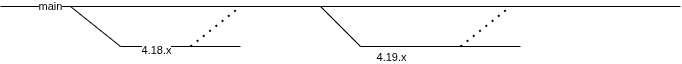

# GitOps standard folder layout for OpenShift multi-cluster day-two configurations

This document explains how to work with this repo.

<!-- TOC -->

- [GitOps standard folder layout for OpenShift multi-cluster day-two configurations](#gitops-standard-folder-layout-for-openshift-multi-cluster-day-two-configurations)
  - [Design Decisions](#design-decisions)
  - [Repo Structure](#repo-structure)
    - [Components](#components)
    - [Groups](#groups)
    - [Clusters](#clusters)
  - [Conventions](#conventions)
  - [Use cases](#use-cases)
    - [Cluster creation](#cluster-creation)
    - [Cluster upgrade](#cluster-upgrade)
    - [Cluster configuration pinning and configuration promotions](#cluster-configuration-pinning-and-configuration-promotions)
    - [Environment variable substitution](#environment-variable-substitution)
    - [Pinning and Promotions](#pinning-and-promotions)

<!-- /TOC -->

## Design Decisions

The general objective is to have a gitops structure that is easy to pick up and get started with. 

In no particular order, here are the design decisions that guides us to this current folder structure.

- ArgoCD Applications for the [App of App pattern](https://argo-cd.readthedocs.io/en/stable/operator-manual/cluster-bootstrapping/#app-of-apps-pattern) are generated via a Helm chart. This was chosen over the ApplicationSet approach. The reason of this choice is that the helm chart approach allows for more fine grained setting of the application parameter. This reason is not very strong anymore.
- Kustomize is the primary templating mechanism, if one needs to use helm charts, that is still possible via the Kustomize [HelmChartInflaterGenerator](https://kubectl.docs.kubernetes.io/references/kustomize/builtins/#_helmchartinflationgenerator_). The reason of this choice are that Kustomize is easy to pick up in general so starting with kustomize is easier for new users. Also having kustomize at the top level provides homogeneity. This without losing flexibly as one can always use helm charts.
- we don't stress on the DRY (do not repreat yourself) principle. This can bring to extremely convoluted kustomize overlays. It's better to have a little repetition in favor of readability.

## Repo Structure

These are the main folders:


### Components

This folder contains all of the root pieces of configurations, these are sometime also called structural part of the configuration, as opposed to the parametric part that depends on groups and clusters. Each piece of configuration resides in its own subfolder. These components should never derive from anything (i.e. their resources and components lists in the `kustomization.yaml` file are empty).


### Groups

This folder contains common pieces of configurations that can be applied to a group of clusters. Groups can capture concepts like the purpose of the cluster (lab,non-prod, prod), the geography of the cluster (west, east, dc1, dc2), the security profile of the cluster (pci, non-pci, connected, disconnected) etc...

Groups are designed to be composable. So, based on the example groups from above, one should be able to express that a cluster belongs to the non-prod, east, pci groups.

The `all` group almost always exists and it captures the configuration that goes in every cluster.

Each group has it own folder. Within this folder, we can find two things: 

- A set of folders containing the group-specific overlays over some set of components.
- A root level kustomization that generates the ArgoCD applications for this group, using the [argocd-app-of-app](.helm/charts/argocd-app-of-app/) helm chart. See the [all group](./groups/all/kustomization.yaml) for example.


In this example, in green you can see the overlays over one component, while in red you can see the resources needed to generate the Argocd Applications for this group.

### Clusters

This folder contains the cluster-specific configurations. As for groups it is made of two parts:

- A set of folders containing the cluster-specific overlays over some set of components.
- A root level kustomization that generates the ArgoCD applications for this group, using the [argocd-app-of-app](.helm/charts/argocd-app-of-app/) helm chart. This kustomization must import the correct groups for this cluster, here is an example:

```yaml
apiVersion: kustomize.config.k8s.io/v1beta1
kind: Kustomization

resources:
  - ../../groups/all
  - ../../groups/prod
```

See also the [hub cluster](./clusters/hub/kustomization.yaml) for example

## Conventions

By convention the operator and the operands are kept separate. Each operator should have its own namespace to "help" OLM. There is naming conventions for the components:

- components that deploy an operator are named with this pattern: `<operator-name>-operator`
- components that deploy an operator configuration are named with this pattern: `<operator-name>-configuration`
- components that deploy an operator instance for singleton operator are named with this pattern: `<operator-name>-instance`

sync waves are applied to make sure that configurations are deployed smoothly:

- operators are deployed with sync wave 5
- operator configurations or operator instances are deployed with sync wave 15
- configurations that rely on fully configured operators are deployed with sync waves 25

The positions between 5, 15 and 25 can be used to accommodate inter-dependencies between operator configurations.

## Use cases

### Cluster creation

The objective is to create clusters as much as possible in a declarative way.
In ACM this is possible by using the agent install in a similar way to what ZTP.
These are the logical steps

1. create [support for infraenvs](./components/acm-configuration/) and serving ISOs
2. create infraenv ([etl6 example](./clusters/hub/overlays/cluster-etl6/kustomization.yaml) and [bm cluster creation helm chart](.helm-charts/bm-cluster-agent-install/templates/infra-env.yaml))
3. create baremetal hosts inventory [etl6 example](./clusters/hub/overlays/cluster-etl6)
4. allow for the hosts to be discovered, this creates the Agents relative to the hosts.
6. create the cluster ([etl6 example](./clusters/hub/overlays/cluster-etl6/kustomization.yaml) and [bm cluster creation helm chart](.helm-charts/bm-cluster-agent-install/templates/agent-cluster-install.yaml))
7. register the cluster to ACM ([etl6 example](./clusters/hub/overlays/cluster-etl6/kustomization.yaml) and [registration helm chart](.helm-charts/cluster-registration/)

### Cluster upgrade

Each cluster has a cluster-specific application called `openshift-config` for [example](./clusters/etl6/overlays/openshift-config/). It it you can find a cluster version [manifest](./clusters/etl6/overlays/openshift-config/cluster-version.yaml).
You can update that manifest to trigger an upgrade. Make sure that all the prerequisites are met first.
This feature is per cluster because the general expectation is that customer will want to finely control when a cluster is upgraded.  

### Cluster configuration pinning and configuration promotions

Clusters can be pinned to a version (of the configuration) by tagging or branching this repo.
Consider the [cluster-version.yaml](./clusters/cluster-versions.yaml) file. In it all clusters are listed with the tag they should be pulling their configuration from. 
A patch is applied to all of the Applications of this cluster to make them point to the selected tag/branch.

This basic mechanism can then ben used to build configuration promotion strategies.




### Environment variable substitution

Kustomize does not allow using variables. It is hermetic by design in the sense that it cannot be influenced externally. We relaxed this constraint to prevent having to do the trivial overlays.

A simple environment variable replacement mechanism is available as a ArgoCD plugin. You can see the plugin definition [here](./components/gitops-boostrap-policy/manifests/gitops-instance/base/setenv-cmp-plugin-configmap.yaml). The environment variables that are available are passed via a [configmap](./components/gitops-boostrap-policy/manifests/gitops-instance/base/environment-variables-configmap.yaml). At the moment the current variables are defined:

- CLUSTER_NAME
- CLUSTER_BASE_DOMAIN
- PLATFORM_BASE_DOMAIN
- HUB_BASE_DOMAIN
- INFRA_GITOPS_REPO

Here you can see an example of how this feature can be used:

```yaml
kind: Route
apiVersion: route.openshift.io/v1
metadata:
  name: kube-ops-view
spec:
  host: "kubeops.apps.${CLUSTER_BASE_DOMAIN}"
  to:
    kind: Service
    name: kube-ops-view
    weight: 100
  port:
    targetPort: 8080
  wildcardPolicy: None
  tls:
    termination: edge
    insecureEdgeTerminationPolicy: Redirect  
```    


